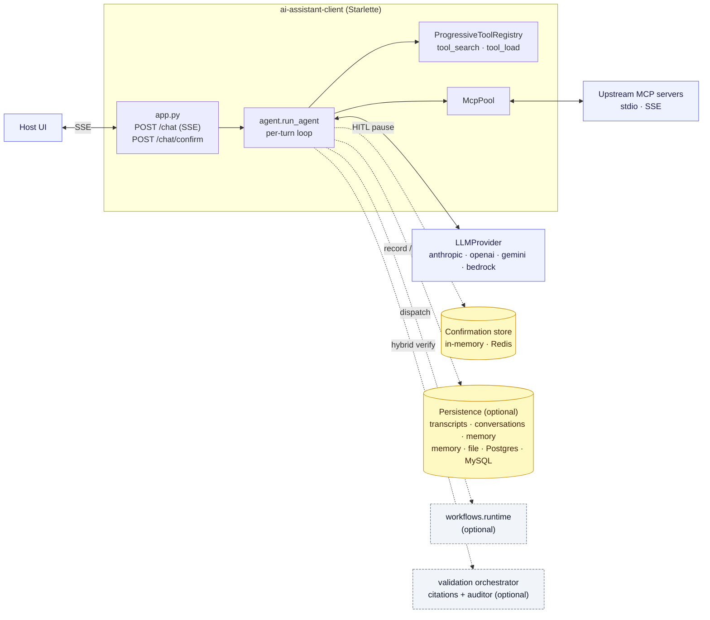
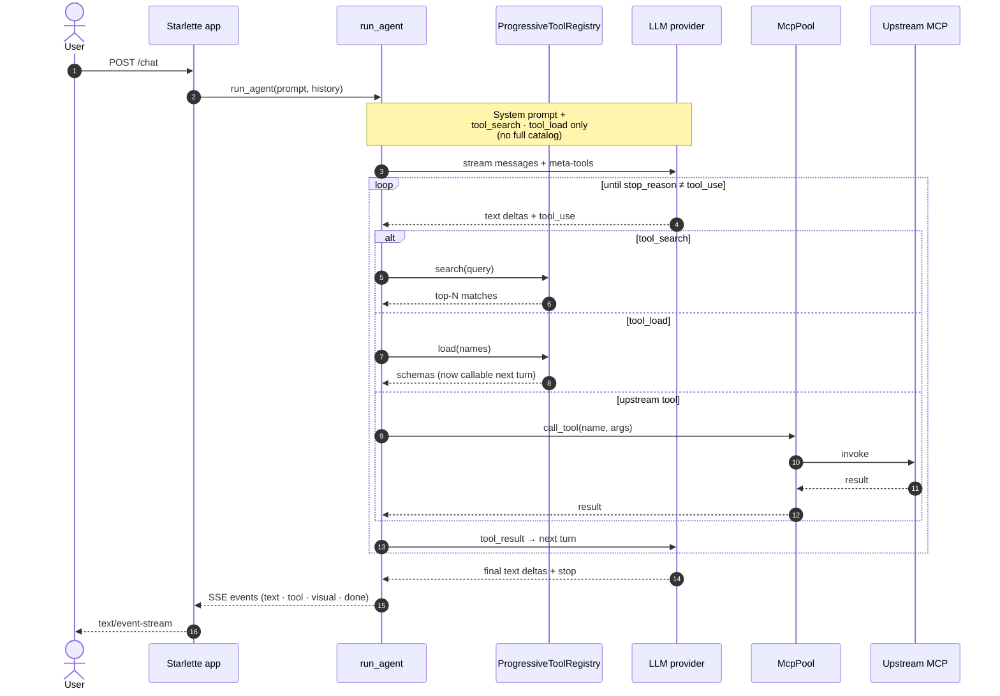

# ai-assistant-client

A provider-agnostic streaming chat client with first-class MCP tool
support and **progressive tool discovery** — the model searches the
catalog and loads schemas on demand instead of receiving every tool's
schema on every turn.

Pick your LLM with a single env var: **Anthropic Claude**, **OpenAI**,
**Google Gemini**, or **AWS Bedrock (Converse)**.

```
client/v1
├── POST /chat        → SSE stream of agent events
├── GET  /tools       → upstream MCP catalog dump
└── GET  /healthz
```

## Architecture

A single Starlette process hosts the SSE endpoint, the per-turn agent
loop, and the MCP pool that routes tool calls to upstream servers.
The LLM is reached through a thin `LLMProvider` adapter so the loop
stays identical across Anthropic / OpenAI / Gemini / Bedrock.
Everything reached by a dashed arrow below is **optional** and
disabled unless the host wires it in.



### One turn, end to end

The loop is **search → load → invoke**: the model first calls
`tool_search` to discover what's available, then `tool_load` to pull
the relevant schemas into context, then the real upstream tool. Only
the meta-tools are present on turn one — the rest of the catalog
never enters the prompt unless the model asks for it.



The agent loop lives in [`ai_assistant_client/agent.py`](ai_assistant_client/agent.py);
provider adapters in [`ai_assistant_client/llm/`](ai_assistant_client/llm);
the MCP pool in [`ai_assistant_client/mcp_pool.py`](ai_assistant_client/mcp_pool.py);
the registry in [`ai_assistant_client/discovery.py`](ai_assistant_client/discovery.py).

## Why progressive discovery

A naive MCP integration loads every upstream tool's schema into the system
prompt. With ~50 tools that's tens of thousands of tokens spent on every
turn — even when only one tool is relevant.

This client exposes only **two** tools to Claude by default:

- `tool_search(query, max_results=5)` — top-N matches by name/description.
- `tool_load(names)` — promotes the named tools' full schemas into the
  conversation for the rest of the session.

The model's loop becomes: **search → load → invoke**. Token spend on tool
schemas scales with what the model actually needs, not with catalog size.
Loaded schemas persist for the session — once `tool_load`ed, a tool can
be called directly on subsequent turns.

## Pluggable LLM providers

Set `LLM_PROVIDER` to pick the backend; the matching SDK is the only
one that needs to be installed.

| `LLM_PROVIDER` | Default model              | Credential env                     | Install extra |
|----------------|----------------------------|------------------------------------|---------------|
| `anthropic`    | `claude-sonnet-4-6`        | `ANTHROPIC_API_KEY`                | `[anthropic]` |
| `openai`       | `gpt-4o`                   | `OPENAI_API_KEY`                   | `[openai]`    |
| `gemini`       | `gemini-2.0-flash`         | `GEMINI_API_KEY` / `GOOGLE_API_KEY`| `[gemini]`    |
| `bedrock`      | `anthropic.claude-3-5-sonnet-20241022-v2:0` | standard AWS credential chain | `[bedrock]` |

Override the model with `LLM_MODEL`. The progressive-tool-discovery
behavior, SSE event shape, and MCP integration are identical across
providers — translation lives entirely in the per-provider adapters
under `ai_assistant_client/llm/`.

## Why a custom provider abstraction (and not LiteLLM/aisuite)

A "universal LLM SDK" is the obvious shortcut. We didn't take it for
two reasons:

**1. Tool-call semantics are the part you don't want a third party
deciding for you.** With MCP, tool input schemas are user-authored
JSON Schema and round-trip back to remote servers as `tool_use_id` →
`tool_result` pairs. Every provider expresses this differently
(Anthropic blocks, OpenAI `tool_calls[]`, Gemini `function_call`
parts, Bedrock Converse `toolUse` blocks), and universal wrappers
normalize to whichever shape they were born from — usually OpenAI's,
which loses fidelity (no per-result error flags, weaker streaming
semantics for partial JSON, ad-hoc `id` correlation). Owning ~100
lines of adapter per provider keeps the loop, the registry, and the
SSE contract unchanged regardless of backend.

**2. Supply-chain risk.** This service holds production LLM
credentials and brokers tool calls into your MCP fleet — it's a
high-value target. Pulling in a broad LLM-gateway dependency widens
the attack surface considerably:

- Every provider SDK is also a transitive dep, even ones you don't use.
- The wrapper itself becomes a privileged credential consumer; a
  compromised release can exfiltrate `ANTHROPIC_API_KEY`,
  `OPENAI_API_KEY`, AWS keys, and request bodies in one shot.
- Some popular LLM-gateway packages ship telemetry, hosted-proxy, or
  auto-update features that quietly route requests through
  third-party infrastructure unless explicitly disabled.
- The wider Python AI tooling ecosystem has seen multiple recent
  supply-chain incidents (typo-squatted packages, credential-stealing
  releases, and a high-profile gateway maintainer key compromise) —
  treat any package that touches model credentials as
  security-critical.

By depending only on the first-party SDK for the provider you've
actually selected (lazy-imported, behind an extras marker), the
service holds no third-party code on the credential path. Anthropic,
OpenAI, Google, and AWS all have well-staffed security teams and
signed releases; that is a defensible perimeter. A wrapper sitting in
front of all four is not.

If you want LiteLLM later, you can write a fifth adapter in ~100
lines — but for the four major providers we ship, it isn't worth the
risk.

## Install

```bash
# Just the core + Anthropic.
pip install "git+https://github.com/ryan-evans-git/ai-assistant-client.git#egg=ai-assistant-client[anthropic]"

# Or any other single provider:
pip install "git+...#egg=ai-assistant-client[openai]"
pip install "git+...#egg=ai-assistant-client[gemini]"
pip install "git+...#egg=ai-assistant-client[bedrock]"

# Everything:
pip install "git+...#egg=ai-assistant-client[all]"
```

Local dev:

```bash
git clone https://github.com/ryan-evans-git/ai-assistant-client.git
cd ai-assistant-client
pip install -e ".[dev,all]"
```

Python 3.11+ required.

## Quickstart

```bash
# Pick a provider (default: anthropic).
export LLM_PROVIDER=anthropic
export ANTHROPIC_API_KEY=sk-ant-...
# Optional: pin a specific model.
# export LLM_MODEL=claude-sonnet-4-6

# Connect to one MCP server over stdio + one over SSE.
export MCP_SERVERS='[
  {"name":"oapi","sse_url":"http://localhost:8765/sse"},
  {"name":"local","command":"ai-assistant-server","args":["--tools-dir","./tools"]}
]'

ai-assistant-client
```

Or via Docker:

```bash
docker build -t ai-assistant-client .
docker run -p 8080:8080 \
  -e LLM_PROVIDER -e LLM_MODEL \
  -e ANTHROPIC_API_KEY \
  -e MCP_SERVERS \
  ai-assistant-client
```

## Use the SSE chat endpoint

```bash
curl -N -X POST http://localhost:8080/chat \
  -H 'Content-Type: application/json' \
  -d '{"message": "List the available pet operations and find pet 1."}'
```

Event stream (each is a JSON `data:` payload):

| Event | Data |
|---|---|
| `user_message` | `{ "content": "..." }` |
| `text_delta` | `{ "text": "..." }` |
| `tool_use` | `{ "id", "name", "input" }` |
| `tool_result` | `{ "id", "content" }` |
| `tool_error` | `{ "id", "name", "error" }` |
| `visual` | `{ "tool_use_id", "schema_version", "spec" }` (when the model calls `render_visual`; see [`VISUAL_SPEC.md`](VISUAL_SPEC.md)) |
| `validation` | `{ "method", "passed", "citations_total", "citations_verified", "issues", "auditor_used", "auditor_model" }` (only when `validation_mode != "off"`) |
| `validation_retry` | `{ "retries_remaining", "feedback_preview" }` (when an auto-retry fires) |
| `turn_complete` | `{ "stop_reason", ... }` |

The client appends user / assistant / tool blocks to its in-memory
history during the stream. Persist `history` between turns by passing
the prior turns back in the next `POST /chat` body.

## Prompt caching

Long conversations with progressive tool discovery accumulate a sizable
stable prefix — the system prompt, the loaded tool catalog, and every
prior turn. Re-sending it on every turn at full input cost adds up
fast.

`AgentRunConfig.enable_prompt_caching` (default **on**) opts each
turn into the provider's prompt-caching feature:

- **Anthropic** — adds `cache_control: ephemeral` markers to the system
  prompt, the tool catalog, and the most recent completed message. The
  cached prefix is re-read at ~10% of the input cost (5-minute TTL).
- **Bedrock** — equivalent `{cachePoint}` blocks at the same logical
  points. Note: not every Bedrock-hosted model supports caching;
  Anthropic models do.
- **OpenAI** — automatic for prompts ≥1024 tokens. The flag is
  accepted for interface symmetry but the adapter doesn't act on it.
- **Gemini 2.5+** — implicit caching is on by default. Same story.

Turn the flag off when cost-debugging or if your target Bedrock model
rejects `cachePoint` blocks. The history shape passed to the provider
adapter is *not* mutated — caching markers are inserted into a
shallow-copied request and the caller's `history` list keeps its
provider-neutral form for use across turns and adapters.

## Human-in-the-loop confirmations

Tools the upstream MCP server marks `requires_confirmation=True`
(see ai-assistant-server's `@tool(requires_confirmation=True, ...)`
or `x-aai-requires-confirmation: true` OpenAPI extension) cause
the agent loop to **pause** before dispatching them.

Flow:

1. Agent emits `tool_confirmation_request` over SSE — the payload
   matches the `ToolConfirmationRequest` shape the React UI expects
   (`request_id`, `tool_use_id`, `tool_name`, `tool_description`,
   `tool_input`, optional `message`, `timeout_seconds`).
2. UI shows the modal; user clicks Confirm or Decline (with an
   optional note).
3. Host sends `POST /chat/confirm` with `{request_id, decision, note?}`.
4. Agent resumes — confirms run normally; declines append a
   "User declined: …" tool_result so the LLM can adapt.
5. Timeout (default 60s, override per-tool) is treated as decline.

Single-worker deployments use an in-memory pending-confirmation
store. Multi-worker deployments (uvicorn `--workers N`, anything
behind a load balancer) need a pubsub channel so a `/chat/confirm`
that lands on a worker other than the streaming one still reaches
the awaiting future:

```bash
pip install ai-assistant-client[redis]
export REDIS_URL=redis://localhost:6379
uvicorn ai_assistant_client.app:app --workers 4
```

Tunables on `AgentRunConfig`:
`confirmation_default_timeout_seconds` (default `60`),
`confirmation_on_timeout` (`"decline"` | `"confirm"`, default decline).

## Multi-step workflows

For flows that need to pause at multiple checkpoints — draft →
review → send, batch with mid-run progress, etc. — drop a Python
file under the workflows directory (default `./workflows`,
override with `WORKFLOWS_DIR`):

```python
# workflows/my_workflows.py
from ai_assistant_client.workflows import (
    workflow, pause_for_confirmation, emit_status,
)

@workflow(
    name="draft_review_send_email",
    description="Draft, review, and send an email with two pauses.",
)
async def draft_review_send_email(*, to: str, subject: str, instructions: str) -> dict:
    await emit_status("Drafting…")
    draft = generate_draft(instructions)
    review = await pause_for_confirmation(
        message="Review draft?",
        preview={"to": to, "subject": subject, "draft": draft},
    )
    if review.decision == "decline":
        return {"sent": False, "reason": review.note}
    final = await pause_for_confirmation(message="Send now?")
    if final.decision == "decline":
        return {"sent": False}
    await emit_status("Sending…")
    return {"sent": True}
```

Workflows surface to the LLM as plain tools (name + description +
JSON Schema derived from the signature) and are dispatched
**inside the agent process**, not via MCP — that's what lets them
pause for `pause_for_confirmation(...)` mid-execution. Each pause
emits the same `tool_confirmation_request` event the per-tool
gate uses, so the same UI handles both.

`emit_status(message, data=...)` produces a `workflow_status` SSE
event the host can render as inline progress.

See `workflows/sample.py` for runnable examples
(`approve_and_send_email`, `draft_review_send_email`,
`bulk_archive_with_review`).

### Record & replay

Workflow runs can be recorded to a pluggable transcript store and
replayed later — useful for regression tests, demos, and forensic
"what actually happened in run X" inspection.

```python
from ai_assistant_client.persistence import make_transcript_store
from ai_assistant_client.workflows.replay import (
    replay_workflow, run_workflow_recording,
)

store = make_transcript_store()  # default: in-memory

# Record:
async for event in run_workflow_recording(
    wf, args, tool_use_id="tu", confirmation_hook=hook,
    store=store, run_id="run-2026-05-14-...",
):
    ...

# Replay (handler is NOT re-invoked; events come from the store):
async for event in replay_workflow(store, "run-2026-05-14-..."):
    ...
```

Pick the backend by env var:

| Env var | Values | Notes |
|---|---|---|
| `AAC_TRANSCRIPT_BACKEND` | `memory` *(default)* / `file` / `sqlite` | Postgres / MySQL / Aurora use `SqlTranscriptStore` with a caller-built connection — see [SQL backends](#sql-backends-aurora-postgres-mysql-rds) below. |
| `AAC_TRANSCRIPT_DIR` | path | Base directory for the `file` backend; defaults to `./transcripts`. One `.jsonl` file per run id. |
| `AAC_TRANSCRIPT_SQLITE_PATH` | path | Path to the sqlite file for the `sqlite` backend; defaults to `./transcripts.sqlite3`. |

A parallel `ConversationStore` (below) handles open-ended chat
history. Adding a new backend (SQL on a local sqlite, SQL on a
managed cloud DB, etc.) is one class implementing the relevant
protocol; no application code changes.

Replay records the workflow boundary (input args + emitted
events + outcome). It does **not** mock tool calls inside the
handler — for that, write the workflow to inject its tool
dependencies and pass mocks at test time.

### Recording, replay, and graph viz from the CLI

Set `AAC_WORKFLOW_RECORDING=on` and every workflow the agent
dispatches gets recorded into whichever transcript backend
you've configured. Then inspect runs offline with the
sub-commands:

```bash
# Run the server with recording on.
AAC_WORKFLOW_RECORDING=on \
AAC_TRANSCRIPT_BACKEND=sqlite \
AAC_TRANSCRIPT_SQLITE_PATH=./transcripts.sqlite3 \
ai-assistant-client

# In another shell: list / replay / draw a recorded run.
ai-assistant-client replay wf_send_email_abc123           # JSON lines on stdout
ai-assistant-client graph wf_send_email_abc123             # Mermaid flowchart
ai-assistant-client graph wf_send_email_abc123 --kind sequence
```

Both sub-commands read the same env vars the server writes
with, so a run recorded on one process is immediately
inspectable from another. Unknown run ids exit non-zero so a
shell pipeline can fail loudly.

### Visualize a recorded run programmatically

Any `RunTranscript` (in-memory, file, or SQL backend) renders to
a Mermaid diagram — useful for embedding in PR descriptions,
runbooks, or static documentation:

```python
from ai_assistant_client.workflows.graph import transcript_to_mermaid

transcript = await store.read("run-2026-05-14-...")
print(transcript_to_mermaid(transcript))                # flowchart (default)
print(transcript_to_mermaid(transcript, kind="sequence"))
print(transcript_to_mermaid(transcript, kind="gantt"))  # timing chart
```

The output is a self-contained Mermaid block — wrap it in
` ```mermaid … ``` ` fences and GitHub / GitLab / Notion will
render it natively. Confirmation pauses become decision
diamonds in the flowchart; `result` and `error` terminal nodes
carry style classes so successes and failures are visually
distinct.

The **Gantt** variant uses the per-event timestamps to show
when each step happened and how long the wait between events
was — useful for latency analysis and for visualising how much
wall time a run spent paused on user confirmation vs. doing
work. Events without timestamps (pre-timestamp recordings) are
skipped; if no events have timestamps the chart renders just
the skeleton so the caller can detect the empty case.

## Conversation history persistence

`run_agent` accepts an optional `(conversation_store, conversation_id)`
pair. When both are set, every message the agent appends to
`history` (the user turn, each assistant turn, each tool_result
turn, validation-retry feedback) is mirrored into the store
under that id:

```python
from ai_assistant_client.persistence import make_conversation_store

store = make_conversation_store()  # default: in-memory
async for event in run_agent(
    user_message="hello",
    history=await store.read("conv-123"),  # seed from prior turns
    ...,
    conversation_store=store,
    conversation_id="conv-123",
):
    ...
```

The store is **write-only from the agent's perspective** — seeding
`history` from prior turns is the caller's responsibility (so
the read path stays a host-side decision, not a hidden side
effect). When `conversation_store` or `conversation_id` is
`None`, persistence is silently disabled.

Pick the backend by env var, independently from the transcript
store:

| Env var | Values | Notes |
|---|---|---|
| `AAC_CONVERSATION_BACKEND` | `memory` *(default)* / `file` / `sqlite` | Postgres / MySQL / Aurora use `SqlConversationStore` with a caller-built connection — see [SQL backends](#sql-backends-aurora-postgres-mysql-rds) below. |
| `AAC_CONVERSATION_DIR` | path | Base directory for the `file` backend; defaults to `./conversations`. One `.jsonl` file per conversation id. |
| `AAC_CONVERSATION_SQLITE_PATH` | path | Path to the sqlite file for the `sqlite` backend; defaults to `./conversations.sqlite3`. |

## SQL backends (Aurora, Postgres, MySQL, RDS)

For durable, multi-host deployments, both stores ship a DB-API 2.0
backend that works with any compliant driver — covering
**sqlite** (stdlib), **PostgreSQL** (incl. AWS Aurora PG +
RDS Proxy), and **MySQL** (incl. Aurora MySQL):

```python
import psycopg  # or psycopg2, pg8000, PyMySQL, mysqlclient, mysql-connector-python
from ai_assistant_client.persistence import (
    Dialect, SqlTranscriptStore, SqlConversationStore,
)

conn = psycopg.connect("postgresql://...")
transcripts = SqlTranscriptStore(conn, dialect=Dialect.POSTGRESQL)
conversations = SqlConversationStore(conn, dialect=Dialect.POSTGRESQL)
```

Why this shape:

- **Zero new dependencies in this package.** You install whichever driver matches your DB. Keeps the credential surface to first-party drivers you've already vetted, in the same spirit as the [no-LiteLLM rationale](#why-a-custom-provider-abstraction-and-not-litellmaisuite).
- **Caller owns the connection.** IAM token minting, TLS config, RDS Proxy endpoints, and pooling all stay upstream where they belong.
- **Aurora Serverless v2** uses standard wire protocol — same drivers work. (Aurora Serverless v1's HTTP Data API is the one path that *doesn't* work via DB-API — but v1 is the legacy variant.)
- **Schema is created on first use** (`CREATE TABLE IF NOT EXISTS`). Tables: `aac_transcript_runs`, `aac_transcript_events`, `aac_conversation_messages`.

Concurrency: the per-id `seq` is computed as `SELECT COALESCE(MAX(seq), 0) + 1`. Within one process the store's `asyncio.Lock` makes this safe. For **cross-process** writes against the same id, the write path now retries up to 3 times when an `IntegrityError` from a `(id, seq)` PK collision indicates another writer beat us to that seq value. This tolerates 2–3 concurrent writers cleanly; under heavier contention, run a dedicated leader recorder or switch to a per-id database sequence.

For the memory store, `seq` only drives read ordering (no unique constraint). Reads include `memory_id ASC` as a deterministic tiebreak so the order is stable even when two records share a `seq` value.

### Native-async drivers (asyncpg / aiomysql)

The DB-API path covers every supported engine via a worker
thread (`asyncio.to_thread`). For hosts that want to avoid that
hop under high recording throughput, drop-in native-async
implementations are available:

```bash
pip install "ai-assistant-client[asyncpg]"   # PostgreSQL incl. Aurora PG
pip install "ai-assistant-client[aiomysql]"  # MySQL incl. Aurora MySQL
```

```python
import asyncpg
from ai_assistant_client.persistence import (
    AsyncpgTranscriptStore, AsyncpgConversationStore,
)

pool = await asyncpg.create_pool("postgresql://...")
transcripts = AsyncpgTranscriptStore(pool)
conversations = AsyncpgConversationStore(pool)
```

```python
import aiomysql
from ai_assistant_client.persistence import (
    AiomysqlTranscriptStore, AiomysqlConversationStore,
)

pool = await aiomysql.create_pool(host=..., user=..., password=..., db=...)
transcripts = AiomysqlTranscriptStore(pool)
conversations = AiomysqlConversationStore(pool)
```

Schema is byte-equivalent to what the DB-API stores create — you
can switch between the sync and async paths against the same
database without migrations.

### Migrating an existing schema

`CREATE TABLE IF NOT EXISTS` (the stores' bootstrap) doesn't
touch existing tables when a column is added in a later release.
For operators with pre-existing data, idempotent migration
helpers are available:

```python
from ai_assistant_client.persistence import (
    Dialect, ensure_transcript_events_ts_column,
)

# Run once at startup after upgrading.  Returns True if the
# column was added, False if it was already there.
ensure_transcript_events_ts_column(conn, dialect=Dialect.POSTGRESQL)
```

Handles all three dialects portably (sqlite uses `PRAGMA
table_info`; PostgreSQL uses `ADD COLUMN IF NOT EXISTS`; MySQL
swallows the duplicate-column error on a concurrent add). The
generic helper `add_column_if_missing(conn, dialect=..., table=...,
column=..., column_type_sql=..., default_sql=...)` covers any
future column additions.

## Per-user memory (storage foundation)

A separate `MemoryStore` protocol for durable typed notes the
host attaches to a user — survives across conversations and is
the building block for personalisation features ("user prefers
concise replies", "user is a data scientist").

```python
from ai_assistant_client.persistence import make_memory_store

store = make_memory_store()  # default: in-process
record = await store.add(
    user_id="alice",
    key="role",
    value="data scientist",
    tags=("work",),
)
later = await store.list(user_id="alice", tags=("work",))
await store.forget_all(user_id="alice")  # GDPR-style erasure
```

For the `file` backend specifically, `compact(user_id=...)`
rewrites the append-only log so only live records remain —
useful after many turns of updates / removes have inflated the
on-disk file. Atomic via tempfile-then-`os.replace` so a crash
mid-compaction leaves the original log intact:

```python
stats = await store.compact(user_id="alice")
log.info(
    "compacted alice's log: %d → %d lines (%d bytes saved)",
    stats.before_lines, stats.after_lines, stats.bytes_saved,
)
```

No-op when the log is already compact (`bytes_saved == 0`) so a
scheduler can call it on every user without first checking.

| Env var | Values | Notes |
|---|---|---|
| `AAC_MEMORY_BACKEND` | `local` *(default)* / `file` / `sqlite` | Postgres / MySQL / Aurora use `SqlMemoryStore` / `AsyncpgMemoryStore` / `AiomysqlMemoryStore` with a caller-built connection. |
| `AAC_MEMORY_DIR` | path | Base directory for the `file` backend; defaults to `./memories`. One `.jsonl` file per user id. |
| `AAC_MEMORY_SQLITE_PATH` | path | Path to the sqlite file for the `sqlite` backend; defaults to `./memories.sqlite3`. |

```python
import psycopg
from ai_assistant_client.persistence import (
    Dialect, SqlMemoryStore, AsyncpgMemoryStore,
)

# DB-API 2.0 — sqlite / Postgres / MySQL / Aurora via any compliant driver.
conn = psycopg.connect("postgresql://...")
store = SqlMemoryStore(conn, dialect=Dialect.POSTGRESQL)

# Or native-async for high-throughput Aurora PG / MySQL.
import asyncpg
pool = await asyncpg.create_pool("postgresql://...")
store = AsyncpgMemoryStore(pool)
```

The SQL stores enforce per-user isolation at the SQL level
(`WHERE memory_id = ? AND user_id = ?` on every operation) — a
caller who knows another user's memory id can't read or mutate
it. Tables: `aac_user_memories` plus a `(user_id, seq)` index
for cheap `list()` reads.

### Agent integration

`run_agent` accepts a `memory_store` + `user_id` pair; when
**both** are set, four LLM-callable meta-tools become available
to the model alongside `tool_search` / `tool_load`:

* `memory_recall(tags?)` — returns the user's memories as JSON.
* `memory_remember(key, value, tags?)` — persists a new memory.
* `memory_update(memory_id, value)` — replaces an existing memory's value (preserves `memory_id`, `key`, `tags`, `created_at`).
* `memory_forget(memory_id)` — deletes a memory.

```python
from ai_assistant_client.persistence import make_memory_store

store = make_memory_store()
async for event in run_agent(
    ...,
    memory_store=store,
    user_id=request_user_id,  # closed over — LLM can't spoof
):
    ...
```

Security: every meta-tool dispatch closes over `user_id` from
the agent's context. An LLM tool-use that includes a `user_id`
field in its arguments is ignored — the value comes from the
host's call to `run_agent`, not from model output. The meta-
tools stay invisible if either `memory_store` or `user_id` is
`None` so a misconfig can't expose the recall surface without
isolation.

### System-prompt injection helper

For hosts that want recalled memories visible to the LLM as
context (rather than fetched on demand), `build_system_prompt_with_memory`
produces the augmented prompt with the recommended
injection-resistance envelope:

```python
from ai_assistant_client.memory_prompt import build_system_prompt_with_memory

result = await build_system_prompt_with_memory(
    base_system_prompt,
    store=store,
    user_id=request_user_id,
    tags=("preference",),  # optional filter
)
config = AgentRunConfig(
    ...,
    system_prompt=result.system_prompt,
)
# Log which memories contributed so an incident can be traced.
log.info("turn used memories: %s", result.memory_ids)
```

The helper wraps recalled content in a `<user_memory>...</user_memory>`
delimiter and prepends a reminder telling the model to treat
the contents as data, not instructions. **This is opt-in** —
the agent doesn't auto-inject so the host keeps product
decisions about which memories to surface, when.

### Privacy invariants the protocol enforces

- **Per-user isolation.** Every `get` / `update` / `remove` /
  `list` takes a `user_id`. A memory written for user A is
  unreachable to user B even if user B knows the id —
  cross-user access raises the same `KeyError` as a missing
  record so it can't be used as an enumeration oracle.
- **GDPR-style erasure.** `forget_all(user_id=...)` removes
  every record; the file backend deletes the user's file
  outright (no tombstone). Returns the count so a host's
  privacy endpoint can confirm to the user.
- **Server-assigned ids.** Memory ids are opaque `mem_{hex}`
  tokens generated by the store. Callers can't inject custom
  ids that could traverse the filesystem in the file backend.

## Visuals (charts, tables, KPI tiles, images)

The model can render structured visuals in the host UI by calling the
built-in `render_visual(schema_version, spec)` meta-tool — alongside
`tool_search` / `tool_load`, no setup required.

```python
# What the model emits (one tool_use, dispatched by the agent loop):
render_visual(
  schema_version=1,
  spec={
    "kind": "chart",
    "chart_type": "bar",
    "title": "Open invoices by aging bucket",
    "data": [
      {"bucket": "0-30",  "count": 12},
      {"bucket": "31-60", "count":  3},
      {"bucket": "60+",   "count":  1}
    ],
    "x_key": "bucket",
    "y_keys": ["count"]
  }
)
```

The agent loop validates the spec (Pydantic), emits an
`AgentEvent("visual", {tool_use_id, schema_version, spec})` for the
host UI to render, and returns a one-line confirmation as the
`tool_result` so the model can compose a follow-up text takeaway.
Malformed specs come back as a friendly error in the tool_result —
the model can correct on the next turn.

**Supported visual kinds (v1):** `chart` (bar / line / area / pie /
donut / scatter), `table`, `kpi` (single-stat with optional trend),
`image`. Full wire schema lives in
[`VISUAL_SPEC.md`](VISUAL_SPEC.md) and is duplicated identically in
`ai-assistant-ui`.

**Image source safety.** Images are restricted to `https://` URLs and
non-SVG `data:image/...` URIs (for previewing host-side uploads).
SVG is rejected (script-carrying surface). Data URIs are size-capped
via `AgentRunConfig.max_image_data_uri_kb` (default 5 MB of decoded
payload).

## Hybrid response validation

LLMs occasionally invent numbers that look reasonable — a dollar
amount that's off by a hundred, a date that's a year ahead, an ID
that doesn't exist. When tool calls are involved, the data was
*right there in the prompt* and the model still got it wrong. This
client ships an opt-in two-layer validation pipeline that catches
those before the user sees them.

### Enable it

```python
from ai_assistant_client.agent import AgentRunConfig, run_agent
from ai_assistant_client.llm import make_provider

config = AgentRunConfig(
    validation_mode="hybrid",      # "off" | "citation" | "audit" | "hybrid"
    citation_strictness="permissive",  # or "strict"
    max_validation_retries=2,      # 0 = emit-only, no retry
    # auditor_model="claude-haiku-4-5-20251001",  # optional override
)

provider = make_provider("anthropic")
async for event in run_agent(
    user_message="...",
    history=history,
    registry=registry,
    dispatcher=dispatcher,
    provider=provider,
    config=config,
    provider_name="anthropic",      # used to pick the default auditor model
    # auditor_provider=provider,    # defaults to the primary; pass a separate
                                    # LLMProvider if you want the auditor to
                                    # use a different vendor / region / key
):
    ...
```

The default — `validation_mode="off"` — is a no-op; existing callers
see zero behavior change.

### How each mode works

| Mode | Citation check | Auditor LLM | Cost | When to pick |
|---|---|---|---|---|
| `off` | — | — | $0 | Default; you accept some risk in exchange for cost + latency. |
| `citation` | ✅ on every turn | — | $0 | Best price/perf. Catches hallucinated *cited* values; misses uncited claims. |
| `audit` | — | ✅ on every turn | ~2× per-turn | No model-side burden. Catches semantic errors but doubles cost + latency. |
| `hybrid` | ✅ on every turn | ✅ only when citation fails | ~1.05× typical | **Recommended.** Cheap when the model gets it right; intelligent fallback when it doesn't. |

### Citation grammar

When validation is on, the system prompt is augmented to ask the
model to cite tool-derived values in this exact form:

```
You owe <cite tu="tu_1" path="$.invoices[2].amount">$1,250.00</cite>
across <cite tu="tu_1" path="$.invoices|length">3</cite> invoices.
```

The verifier then resolves the JSONPath against the actual
`tool_result` content and compares the displayed value to the data
using type-aware normalization (currency: `"$1,250.00"` ↔ `1250.0`;
dates: `"March 15, 2026"` ↔ `"2026-03-15T..."`; counts, percentages,
IDs, strings, booleans). The JSONPath subset supports `$.foo`,
`$.foo[0]`, `$.foo[*]`, `$.foo[?(@.id==42)]`, and the filters
`|length`, `|sum`, `|count` — enough for typical agent reasoning,
no third-party dependency.

### What happens when validation fails

```
turn ends → run_validation → emit AgentEvent("validation", ...)
                          ↳ if passed or retries==0: emit turn_complete (done)
                          ↳ otherwise:
                               append synthetic user-message to history
                                 with: feedback + "OK to not know" reminder
                               emit AgentEvent("validation_retry", ...)
                               re-run the assistant turn
```

The "OK to not know" reminder explicitly tells the model that
*acknowledging uncertainty is always better than guessing* — pushing
it away from the doubling-down failure mode that naive retry loops
can otherwise reinforce.

The retry budget is hard-capped (`max_validation_retries`, default
`2`). After it's exhausted the agent yields `turn_complete` with the
final `validation` event still showing failures — the host decides
whether to render the response, hide it, or surface a warning.

### Issue kinds the verifier produces

| Kind | Source | Severity | Meaning |
|---|---|---|---|
| `value_mismatch` | citation | error | Path resolved, but the displayed value doesn't match the data. |
| `broken_citation` | citation | error | The `path` doesn't resolve in the cited tool_result. |
| `unknown_tool_use_id` | citation | error | The `tu` attribute doesn't match any tool_result in history. |
| `non_json_substring_miss` | citation | warning | Tool result was free text; displayed value isn't a substring. |
| `auditor_finding` | auditor | error/warning | The auditor LLM flagged a claim. |
| `auditor_unavailable` | auditor | warning | Auditor was needed but no provider was configured. |

### Configuration reference

| Field on `AgentRunConfig` | Default | Purpose |
|---|---|---|
| `validation_mode` | `"off"` | `"off"` \| `"citation"` \| `"audit"` \| `"hybrid"`. |
| `citation_strictness` | `"permissive"` | `"strict"` treats any uncited concrete value as a failure (and triggers the auditor in hybrid mode). |
| `auditor_model` | provider default | Override the auditor model. Defaults: Anthropic → `claude-haiku-4-5`, OpenAI → `gpt-4o-mini`, Gemini → `gemini-2.0-flash-lite`, Bedrock → Haiku-on-Bedrock. |
| `max_validation_retries` | `2` | `0` = emit the validation event, never retry. |

### Event payloads

```json
event: validation
data: {"method":"hybrid","passed":false,"citations_total":2,
       "citations_verified":1,"auditor_used":true,
       "auditor_model":"claude-haiku-4-5-20251001",
       "issues":[{"kind":"value_mismatch","severity":"error",
                  "claim":"$9,999.00","reason":"...","source":"citation",
                  "tool_use_id":"tu_1","path":"$.amount","expected":1250.0}]}

event: validation_retry
data: {"retries_remaining":1,"feedback_preview":"[validation] Your previous response..."}
```

Hosts that don't care about validation can simply ignore both events
— the `text_delta` / `tool_use` / `tool_result` / `turn_complete`
stream is unchanged.

## Configuration

| Variable | Default | Purpose |
|---|---|---|
| `LLM_PROVIDER` | `anthropic` | One of `anthropic`, `openai`, `gemini`, `bedrock`. |
| `LLM_MODEL` | provider default | Override the model name passed to the provider. |
| `ANTHROPIC_API_KEY` | — | Required when `LLM_PROVIDER=anthropic`. |
| `OPENAI_API_KEY` | — | Required when `LLM_PROVIDER=openai`. |
| `GEMINI_API_KEY` / `GOOGLE_API_KEY` | — | Required when `LLM_PROVIDER=gemini`. |
| `AWS_*` (standard chain) | — | Used when `LLM_PROVIDER=bedrock`. |
| `MCP_SERVERS` | _(optional)_ | JSON array of upstream MCP servers. |
| `AI_ASSISTANT_CLIENT_HOST` | `127.0.0.1` | Bind host. |
| `AI_ASSISTANT_CLIENT_PORT` | `8080` | Bind port. |
| `AI_ASSISTANT_CLIENT_LOG_LEVEL` | `INFO` | Logger level. |

`MCP_SERVERS` entry shape:

```json
{
  "name": "oapi",
  "sse_url": "http://localhost:8765/sse",       // OR command/args
  "command": "ai-assistant-server",
  "args": ["--tools-dir", "./tools"],
  "env": {"ANY_EXTRA_ENV": "..."},
  "forwarded_credentials": {"bearerAuth": "<token>"}
}
```

`forwarded_credentials` is passed to the upstream MCP server keyed by
OpenAPI security-scheme name — useful for acting on behalf of an
authenticated end-user.

## Library use (no HTTP server)

```python
import asyncio
from ai_assistant_client import McpPool, McpServerConfig, ProgressiveToolRegistry
from ai_assistant_client.discovery import RemoteToolDescriptor
from ai_assistant_client.agent import AgentRunConfig, run_agent
from ai_assistant_client.llm import default_model, make_provider


async def main() -> None:
    configs = [
        McpServerConfig(name="oapi", sse_url="http://localhost:8765/sse"),
    ]
    async with McpPool(configs) as pool:
        tools = await pool.list_all_tools()
        registry = ProgressiveToolRegistry(
            [RemoteToolDescriptor(name=t.name, description=t.description, input_schema=t.input_schema) for t in tools]
        )
        provider = make_provider("anthropic")  # or "openai" / "gemini" / "bedrock"
        history: list[dict] = []
        async for event in run_agent(
            user_message="What pet operations are available?",
            history=history,
            registry=registry,
            dispatcher=pool.call_tool,
            provider=provider,
            config=AgentRunConfig(model=default_model("anthropic")),
        ):
            print(event.type, event.data)


asyncio.run(main())
```

## Project layout

```
ai_assistant_client/
  app.py                 # Starlette + SSE service
  agent.py               # Streaming agent loop with tool dispatch
  discovery.py           # ProgressiveToolRegistry + meta-tools
  mcp_pool.py            # Live sessions to N upstream MCP servers
  llm/
    base.py              # LLMProvider ABC + normalized event types
    anthropic_provider.py
    openai_provider.py
    gemini_provider.py
    bedrock_provider.py  # Bedrock Converse API
    __init__.py          # make_provider() factory + default_model()

tests/                   # pytest, no real LLM / MCP traffic
```

## Companion projects

- [ai-assistant-server](https://github.com/ryan-evans-git/ai-assistant-server)
  — generic MCP server that auto-loads tools from OpenAPI specs.
- [ai-assistant-ui](https://github.com/ryan-evans-git/ai-assistant-ui)
  — drop-in React chat panel that consumes this client's SSE events.

## Development

```bash
pip install -e ".[dev]"
pytest
```

## License

MIT
